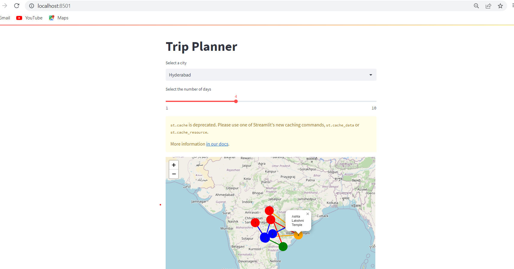

# Project-1-Feynn-labs-Trip-planner-using-Streamlit

## Web application to plan a trip with user's required city and number of days to stay
This project is a web application using streamlit contains **machine learning model** uses **K-means** that produce trip schedule to visit places based on user input. 

### places_dataset:
It uses a dataset of place reviews and ratings to identify popular places, and then uses the OpenCage API to obtain latitude and longitude coordinates for each place. The resulting dataset is saved as a CSV file called unique_places.csv.

# Streamlit Web application:
The user can input the name of a city and the number of days they plan to stay there. Output displays a map of the city with markers for the closest recommended places to visit. The markers are color-coded based on the number of days recommended to spend at each location.

## Getting Started
To use this project, you will need to install the following dependencies:

pandas
opencage
folium
streamlit
You can install these dependencies using pip:
**pip install pandas opencage folium streamlit streamlit-folium**

Once you have installed the dependencies, you can run the places dataset.ipynb notebook to generate the unique_places.csv file. Then, you can run the project with run streamlit command to generate user interface which asks user to enter city and days required  then it will produce a Trip schedule shortest path map like which day which places to visit.

## Example Map image when user selected City=Hyderabad and Days=4

